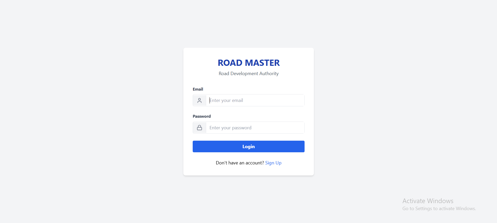
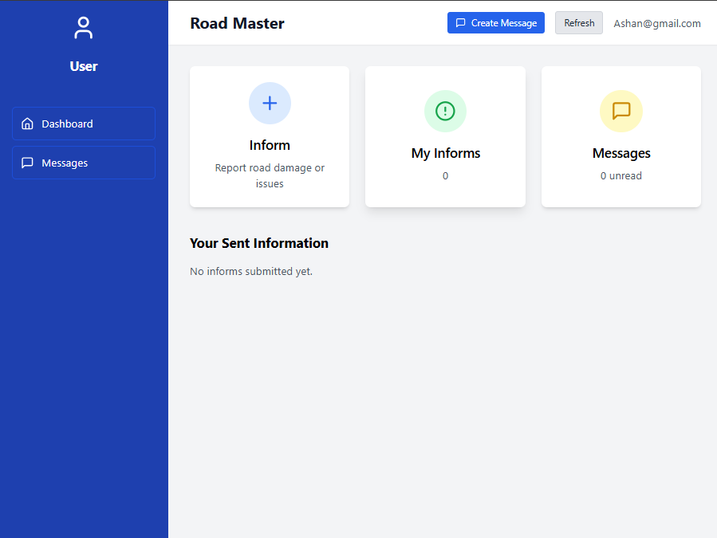
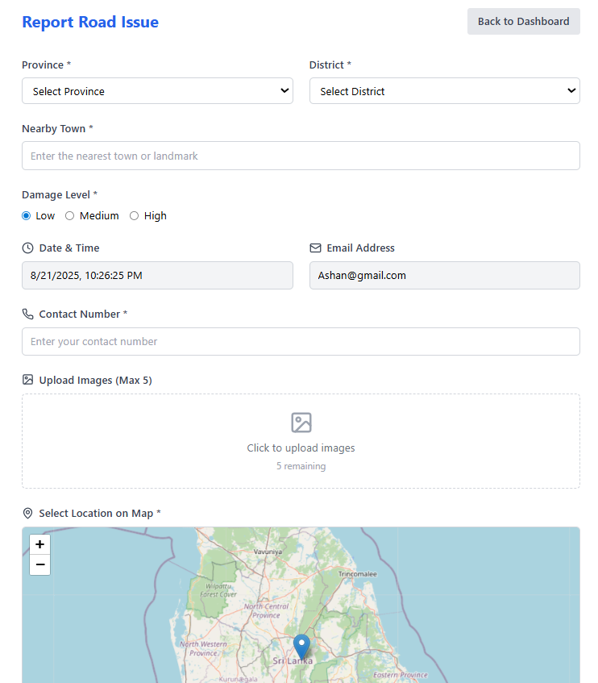
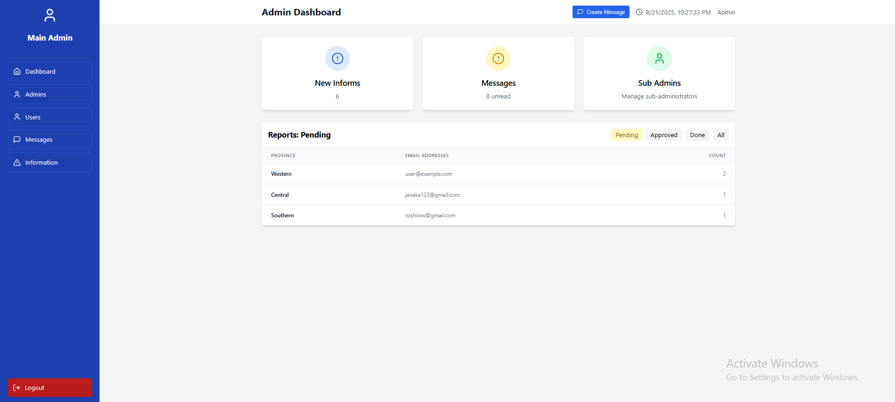
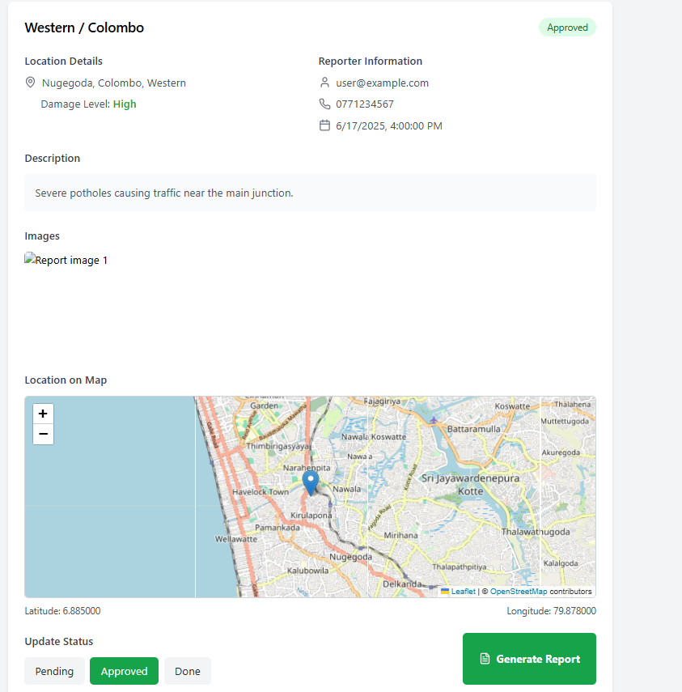

# 🚧 ROAD MASTER  

ROAD MASTER is a MERN stack web application designed to help citizens easily **report road damages or road-related issues** directly to the **Road Development Authority (RDA)**. The system ensures smooth communication between the public, the main RDA office, and sub-offices, allowing for better maintenance and faster response to road problems.  

---

## 📌 Features  
---if you want run it  using this credintial

main admin email = Ashan@Admin.com  || pw 123 ,
sub admin = Ashan@SubAdmin.com || pw 123,
user = Ashan@gmail.com  || pw 123
  

### 👤 User  
- Sign up & login with **Email or Google**.  
- Navigate to a **User Dashboard** (UDash.jpg reference).  
- Report road-related problems via an **inform form**:  
  - Select **Province, District, and Nearby Town**.  
  - Choose **Damage Level** (Low / Medium / High).  
  - **Auto-fill** fields: Time, Date, and Email.  
  - Add **Contact Number**.  
  - Upload up to **5 images**.  
  - Select **location on Google Maps** (Latitude & Longitude).  
  - Provide an **Additional Message**.  
  - Submit or Cancel.  
- Receive an **automatic confirmation message** after submitting.  

### 🛠 Main Admin  
- Log in and access the **Admin Dashboard** (addDash.jpg reference).  
- View all user-submitted reports.  
- Open a report tab showing **Province & District** (informTab.jpg).  
- Assign reports to **Sub Admins** via a dropdown & confirmation popup.  
- Automatically notify the user: *"Thank you for informing us, we will inquire."*  
- Manage **Sub Admin accounts** (Add, Edit, Delete).  

### 🏢 Sub Admin  
- Log in and access the **Sub Admin Dashboard** (SubAddDash.jpg reference).  
- View assigned user reports (Province & District on cards).  
- Open details of each inquiry.  
- Update **Status** of reports:  
  - Pending (default)  
  - Approved  
  - Done  
- Generate a **Report** for completed inquiries.  

---

## 🏗 Tech Stack  

- **Frontend:** React (JSX files), Tailwind / CSS  
- **Backend:** Node.js, Express.js  
- **Database:** MongoDB  
- **Authentication:** Email & Google Login (OAuth)  
- **Cloud Storage:** Image Upload Support (5 per report)  
- **Maps:** Google Maps API for location input  

---

## 🔄 System Workflow  

1. **User** → Submits road issue form with details & images.  
2. **Main Admin** → Reviews report → Assigns to **Sub Admin**.  
3. **Sub Admin** → Updates status → Generates report.  
4. **User** → Receives confirmation & status updates.  

---

## 📂 Project Structure  

---

## 📸 Screenshots  

### 🔑 Login Page  
  

### 🧑‍💻 User Dashboard  
  

### 📝 Report Form  
  

### 🛠 Main Admin Dashboard  
  

### 🏢 Sub Admin Dashboard  
  

### 📊 Sub Admin Actions  
  

---

## 🚀 Future Enhancements  

- Real-time notifications (WebSockets).  
- Advanced search & filtering for reports.  
- Mobile App version for faster access.  
- AI-based damage severity classification (image recognition).  

---

## 👨‍💻 Contributors  

- **Main Admin & Project Lead** – Road Development Authority  
- **Frontend & Backend Developers** – MERN Stack Team  
- **Database & Deployment** – MongoDB / Cloud Hosting  

